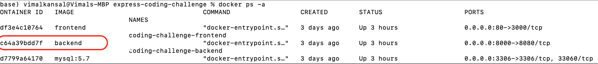
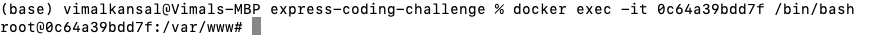
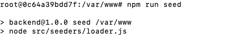

# Sidekicker Coding Challenge

## Setup
* Install [Docker](https://docs.docker.com/get-started/)
* Build: `docker-compose build`
* Run: `docker-compose up`
* Seed the data : 
    Find the container id of the backend container:
      
    Log into this container :
    
    Run the seed command
    
    Wait for the seed to finish.
* Execute tasks: `docker-compose exec <container_name> <cmd>`. E.g.
  * `docker-compose exec coding-challenge-backend npx sequelize-cli db:create`
  * `docker-compose exec coding-challenge-backend npx sequelize-cli db:migrate`

## Development
* React frontend: http://localhost
* Express backend: http://localhost:8000

## Assumptions

1. Location, applicant's name must be less than or equal to 255 characters.
2. Dates will not include time.
3. "You can assume locations are limited to what's included in the list and the data should not be modified." -> Since I am not supposed to modify the data, I have not removed the location from the description field. Because the locations are simply limited to what's present in the dataset, I have decided to hardcode the list of city names based on the dataset.
